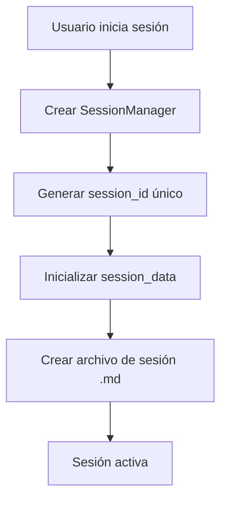
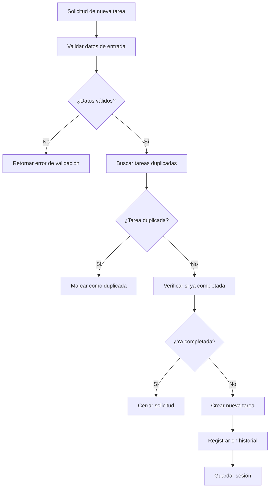
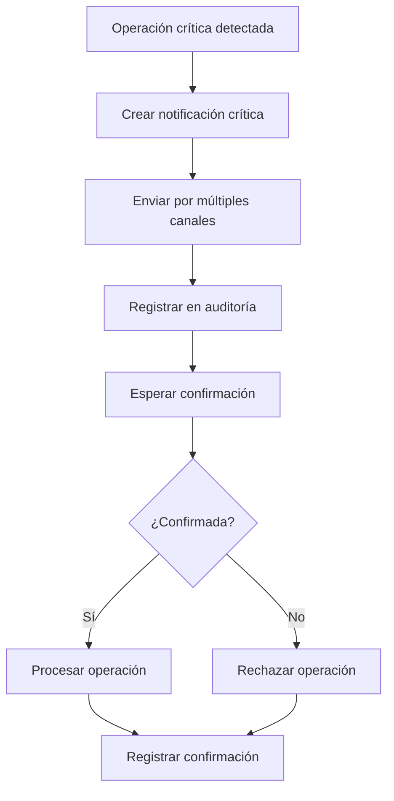

# Sistema de Gestión de Sesiones y Auditoría - FinTech ESCROW

## Resumen Ejecutivo

Este documento describe el sistema de gestión de sesiones, seguimiento de tareas y auditoría implementado para la plataforma FinTech ESCROW, siguiendo las buenas prácticas especificadas en el documento Claude.md.

## Características Principales

### 1. Gestión de Sesiones Persistente
- **Persistencia de Contexto**: Mantiene el contexto relevante por sesión de usuario
- **Roles y Etapas**: Respeta roles (admin, vendedor, comprador, broker, asesor) y etapas del flujo ESCROW
- **Trazabilidad Completa**: Registra cada acción relevante en el historial de actividad
- **Resumen de Sesión**: Genera resúmenes estructurados en formato Markdown

### 2. Sistema de Seguimiento de Tareas
- **Detección de Duplicados**: Busca automáticamente tareas duplicadas antes de crear nuevas
- **Validación de Estado**: Verifica si las tareas están activas, programadas o completadas
- **Consolidación Inteligente**: Sugiere merge de tareas duplicadas
- **Cierre Automático**: Cierra tareas ya completadas e invita a agregar información complementaria

### 3. Notificaciones Críticas
- **Confirmación Obligatoria**: Requiere confirmación explícita para cambios críticos
- **Trazabilidad y Auditabilidad**: Proporciona trazabilidad completa de cambios
- **Múltiples Canales**: Email, SMS, push notifications y WebSockets
- **Timeouts**: Configuración de timeouts para confirmaciones críticas

### 4. Generación de Documentos con IA
- **Contratos ESCROW**: Generación automatizada de contratos
- **Checklists KYC**: Listas de verificación personalizadas por rol
- **Plantillas de Disputas**: Templates para resolución de conflictos
- **Revisión Humana**: Marca documentos que requieren revisión legal

### 5. Asistente de Onboarding
- **Validación Progresiva**: Valida campos requeridos paso a paso
- **Mensajes Claros**: Proporciona mensajes de error y sugerencias claras
- **Guías Contextuales**: Genera guías específicas para cada paso
- **Validación KYC/AML**: Implementa restricciones reales de cumplimiento

## Arquitectura del Sistema

### Componentes Principales

#### 1. SessionManager
```python
class SessionManager:
    - user_id: int
    - role: str
    - session_id: str
    - session_data: Dict[str, Any]
    
    # Métodos principales
    - create_task()
    - update_task_status()
    - add_validation()
    - add_error()
    - add_recommendation()
    - get_session_summary()
```

#### 2. TaskManager
```python
class TaskManager:
    - session_manager: SessionManager
    
    # Métodos principales
    - create_task_with_validation()
    - get_tasks_by_status()
    - get_critical_tasks()
    - _validate_task_data()
    - _find_duplicate_task()
```

#### 3. CriticalNotificationManager
```python
class CriticalNotificationManager:
    - session_manager: SessionManager
    
    # Métodos principales
    - create_critical_notification()
    - handle_transaction_status_change()
    - handle_payment_processed()
    - handle_funds_released()
    - confirm_notification()
    - reject_notification()
```

#### 4. AuditMiddleware
```python
class AuditMiddleware:
    - service_name: str
    - sensitive_endpoints: List[str]
    - critical_operations: List[str]
    
    # Métodos principales
    - dispatch()
    - _log_request()
    - _log_response()
    - _log_error()
    - _log_critical_operation()
```

## Flujo de Trabajo

### 1. Inicio de Sesión


### 2. Creación de Tareas


### 3. Notificaciones Críticas


## Reglas de Negocio Implementadas

### 1. Validación de Duplicados
- **Algoritmo de Similitud**: Compara títulos y descripciones usando similitud de texto
- **Umbral de Similitud**: 80% de similitud para considerar duplicado
- **Consolidación**: Sugiere merge automático de tareas duplicadas
- **Referencias**: Mantiene referencias a tareas originales

### 2. Validación de Estado
- **Verificación de Completitud**: Verifica si tarea ya fue completada
- **Información Complementaria**: Permite agregar información adicional
- **Cierre Inteligente**: Cierra automáticamente tareas completadas
- **Auditoría**: Registra todas las acciones de consolidación

### 3. Notificaciones Críticas
- **Operaciones Sensibles**: Identifica automáticamente operaciones críticas
- **Confirmación Obligatoria**: Requiere confirmación explícita del usuario
- **Timeouts**: Configuración de timeouts para confirmaciones
- **Múltiples Canales**: Email, SMS, push, WebSocket

### 4. Cumplimiento KYC/AML
- **Validación de Documentos**: Verifica CURP, INE, RFC según reglas mexicanas
- **Verificación de Identidad**: Integración con Truora para verificación
- **Documentos Requeridos**: Lista específica por rol de usuario
- **Validación Progresiva**: Verifica documentos paso a paso

## Formato de Resumen de Sesión

### Estructura del Archivo Markdown
```markdown
# Session Summary - {session_id}

## Basic Information
- **User ID**: {user_id}
- **Role**: {role}
- **Start Time**: {start_time}
- **End Time**: {end_time}

## Task Summary
- **Total Tasks**: {total_tasks}
- **Active Tasks**: {active_tasks}
- **Completed Tasks**: {completed_tasks}
- **Duplicate Tasks**: {duplicate_tasks}

## Activity Summary
- **Total Validations**: {total_validations}
- **Total Errors**: {total_errors}
- **Total Recommendations**: {total_recommendations}
- **Critical Recommendations**: {critical_recommendations}

## Tasks
### {task_title}
- **ID**: {task_id}
- **Status**: {status}
- **Priority**: {priority}
- **Created**: {created_at}
- **Description**: {description}

## Activities
- **{timestamp}** - {activity_type}: {description}

## Validations
- **{timestamp}** - {validation_type}: {description} - {status}

## Errors
- **{timestamp}** - {error_type}: {description}

## Recommendations
- **{timestamp}** - {recommendation_type}: {description} {review_required}
```

## API Endpoints

### Gestión de Sesiones
- `POST /sessions/start` - Iniciar nueva sesión
- `GET /sessions/current` - Obtener sesión actual
- `GET /sessions/{session_id}/summary` - Obtener resumen de sesión
- `DELETE /sessions/{session_id}` - Limpiar sesión

### Gestión de Tareas
- `POST /tasks` - Crear nueva tarea
- `GET /tasks` - Listar tareas
- `PUT /tasks/{task_id}/status` - Actualizar estado de tarea
- `GET /tasks/critical` - Obtener tareas críticas

### Notificaciones Críticas
- `POST /notifications/critical` - Crear notificación crítica
- `GET /notifications/pending` - Obtener notificaciones pendientes
- `POST /notifications/{id}/confirm` - Confirmar notificación
- `POST /notifications/{id}/reject` - Rechazar notificación

### Generación de Documentos
- `POST /documents/generate/escrow-contract` - Generar contrato ESCROW
- `POST /documents/generate/kyc-checklist` - Generar checklist KYC

### Validación de Cumplimiento
- `POST /compliance/validate-operation` - Validar operación
- `POST /onboarding/validate-step` - Validar paso de onboarding

## Configuración

### Variables de Entorno
```env
# Session Management
SESSION_TIMEOUT_MINUTES=60
MAX_SESSIONS_PER_USER=5

# Critical Notifications
NOTIFICATION_RETENTION_DAYS=30
CRITICAL_NOTIFICATION_TIMEOUT_HOURS=24

# Compliance
KYC_REQUIRED_AMOUNT_THRESHOLD=10000.0
DUAL_APPROVAL_REQUIRED_AMOUNT_THRESHOLD=50000.0
```

### Reglas de Negocio
```python
BUSINESS_RULES = {
    "user_roles": {
        "admin": {"permissions": ["all"], "kyc_required": False},
        "advisor": {"permissions": ["view_all", "manage_disputes"], "kyc_required": True},
        "seller": {"permissions": ["create_transactions"], "kyc_required": True},
        "buyer": {"permissions": ["create_transactions"], "kyc_required": True},
        "broker": {"permissions": ["facilitate_transactions"], "kyc_required": True}
    },
    "transaction_statuses": {
        "pending_agreement": {"allowed_operations": ["accept", "cancel"]},
        "payment_received": {"allowed_operations": ["ship"], "critical": True},
        "funds_released": {"allowed_operations": [], "critical": True}
    }
}
```

## Seguridad y Cumplimiento

### 1. Protección de Datos Sensibles
- **Encriptación**: Todos los datos sensibles están encriptados
- **Acceso Restringido**: Solo usuarios autorizados pueden acceder a sesiones
- **Auditoría Completa**: Registro de todos los accesos y modificaciones
- **Retención**: Configuración de retención de datos según regulaciones

### 2. Validación de Operaciones
- **Verificación de Permisos**: Valida permisos antes de ejecutar operaciones
- **Flujo ESCROW**: Valida que las operaciones sigan el flujo correcto
- **Aprobación Dual**: Requiere aprobación de ambas partes para operaciones críticas
- **Timeouts**: Configuración de timeouts para evitar operaciones colgadas

### 3. Cumplimiento Regulatorio
- **KYC/AML**: Implementa validaciones según regulaciones mexicanas
- **Trazabilidad**: Mantiene trazabilidad completa de todas las operaciones
- **Reportes**: Genera reportes para autoridades cuando sea necesario
- **Retención**: Configuración de retención de datos según regulaciones

## Monitoreo y Alertas

### 1. Métricas de Sesión
- **Tiempo de Sesión**: Duración promedio de sesiones
- **Tareas por Sesión**: Número promedio de tareas por sesión
- **Tasa de Completitud**: Porcentaje de tareas completadas
- **Tasa de Duplicados**: Porcentaje de tareas duplicadas detectadas

### 2. Alertas Críticas
- **Notificaciones Expiradas**: Alertas para notificaciones no confirmadas
- **Operaciones Críticas**: Alertas para operaciones que requieren atención
- **Errores del Sistema**: Alertas para errores que afectan el funcionamiento
- **Violaciones de Seguridad**: Alertas para intentos de acceso no autorizado

### 3. Dashboards
- **Dashboard de Sesiones**: Vista en tiempo real de sesiones activas
- **Dashboard de Tareas**: Estado de tareas y métricas de productividad
- **Dashboard de Notificaciones**: Estado de notificaciones críticas
- **Dashboard de Cumplimiento**: Métricas de cumplimiento KYC/AML

## Consideraciones de Implementación

### 1. Escalabilidad
- **Redis**: Uso de Redis para almacenamiento de sesiones en producción
- **Load Balancing**: Distribución de carga entre múltiples instancias
- **Caching**: Cache de datos frecuentemente accedidos
- **Sharding**: Particionamiento de datos por usuario o región

### 2. Rendimiento
- **Índices**: Índices optimizados para consultas frecuentes
- **Paginación**: Paginación de resultados para evitar sobrecarga
- **Compresión**: Compresión de datos de sesión para reducir uso de memoria
- **Cleanup**: Limpieza automática de sesiones expiradas

### 3. Mantenimiento
- **Logs Estructurados**: Logs en formato JSON para fácil análisis
- **Métricas**: Métricas detalladas para monitoreo
- **Health Checks**: Verificaciones de salud del sistema
- **Backup**: Backup regular de datos de sesión

## Conclusión

El sistema de gestión de sesiones y auditoría implementado proporciona una base sólida para el cumplimiento de las buenas prácticas especificadas en el documento Claude.md. El sistema garantiza:

- **Persistencia de Contexto**: Mantiene el contexto relevante por sesión
- **Detección de Duplicados**: Evita tareas duplicadas y consolida información
- **Trazabilidad Completa**: Registra todas las acciones para auditoría
- **Notificaciones Críticas**: Requiere confirmación para operaciones sensibles
- **Cumplimiento Regulatorio**: Implementa validaciones KYC/AML
- **Generación de Documentos**: Asistencia con IA para documentos legales
- **Onboarding Inteligente**: Guía paso a paso para nuevos usuarios

El sistema está diseñado para ser escalable, seguro y fácil de mantener, proporcionando una base sólida para el crecimiento futuro de la plataforma FinTech ESCROW.
